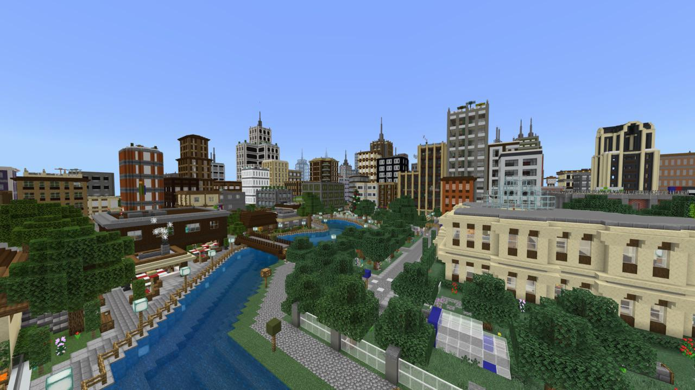

# Background

## What's the goal of this repo
The goal of this repo is to perform deep learning on minecraft data using fVDB.

[fVDB](https://github.com/AcademySoftwareFoundation/openvdb/tree/feature/fvdb/fvdb) is a PyTorch extension which allows for efficient deep learning on sparse volumetric data (Encoded as NanoVDBs).

Minecraft data consists of:

1. Game generated Worlds, Chunks & Regions
2. User generated Maps/Worlds
3. Minecraft Schematics

The motivation for this repo is that Minecraft UGC seems to be an overlooked data source, which could be benificial to the development of large-scale 3D worlds.

There are tens to hundreds of thousands of towns and cities that users have built and released publicly for anyone to use. It would seem plausible that using this data we can train a generative model to build novel worlds.

Example of a user built city:

## What does this repo currently include?
The main contribution of this repo thu>s far is an extremely fast (and only existing) implementation of a minecraft world/region/chunk to nvdb serializer. The fast parser itself is also usable as a standalone library, it doesn't necessarily have to serialize to nvdb files.

The secondary part is an example of using a SparseUNet built with fvdb in order to predict what block each voxel in an nvdb grid belongs to, given occupancy information.

## Directory Structure
 * [data/](./data)
    * [processing/](./data/processing/)
        * [serialize_world_chunks.cpp](./data/processing/serialize_world_chunks.cpp) Script which serializes all chunks in all worlds and stores them as nvdbs in data/training_data/chunks/
        * [serialize_world_regions.cpp](./data/processing/serialize_world_regions.cpp) Script which serializes all regions in all worlds and stores them as nvdbs in data/training_data/regions/
    * [raw_data/](./data/raw_data/)
        * [custom_saves/](./data/raw_data/custom_saves/) Worlds (saves) generated within minecraft then moved here
        * [schematics/](./data/raw_data/schematics/) Minecraft schematics downloaded off the web
    * [training_data/](./data/training_data/)
        * [chunks/](./data/training_data/chunks/) Chunks saved as nvdbs. Name format: world.globalChunkX.globalChunkZ.nvdb
        * [regions/](./data/training_data/regions/) Regions saved as nvdbs. Name format: world.regionX.regionZ.nvdb
 * [minecraft-serialization/](./minecraft-serialization) Contains a library for parsing and serializing minecraft worlds.
    * [archive/](./minecraft-serialization/archive/) Old attempts at serialization that are being kept for reference. Using prebuilt libraries that were very slow.
    * [examples/](./minecraft-serialization/examples/) Some example usages of NBTParser.h
    * [helpers.h](./minecraft-serialization/helpers.h) Helper functions used within the library
    * [NBTParser.h](./minecraft-serialization/NBTParser.h) The main Named Binary Tag (NBT) parsing logic. NBTs are minecraft's custom data format for world data.
    * [NBTVDB.h](./minecraft-serialization/NBTVDB.h) An extension to NBTParser.h which is used to serialize worlds into OpenVDB grids.
 * [example.ipynb](./example.ipynb) Notebook which trains a SparseUNet to predict block type per voxel given grid occupancy.
 * [UNet.py](./UNet.py) Contains the implementation for SparseUNet.
 * [utils.py](./utils.py) Contains some utility/helper functions for test.ipynb

# Dependencies
TODO: Create streamlined procedure.

## Data processing
In order to use the minecraft-serialization library and data/processing OpenVDB and NanoVDB is required. It can be gotten from its [Github repo](https://github.com/AcademySoftwareFoundation/openvdb.git), and should be built with:
- OPENVDB_BUILD_CORE
- OPENVDB_BUILD_NANOVDB
- USE_NANOVDB
- NANOVDB_USE_CUDA
- USE_BLOSC

## UNet Example
FVDB is required which can be gotten from the same github repo in the feature/fvdb branch. Within the conda environment created during the fvdb setup, pip install IPython and matplotlib.

# Definitions 
- **Named Binary Tag (NBT)**: Minecraft's custom data format for a variety of uses such as world data. [NBT Data Format](https://minecraft.fandom.com/wiki/NBT_format)
- **Chunk**: A 16x16 block region of a minecraft world. [Chunk Data Format](https://minecraft.fandom.com/wiki/Chunk_format)
- **Region**: A 32x32 chunk or 512x512 region of a minecraft world. Minecraft stores worlds as seperate region files. [Region Data Format](https://minecraft.fandom.com/wiki/Region_file_format)
- **Schematic**: Schematics are an unofficial (but widely used) datatype which is used to import specific structures into worlds. (Such as a house, build, town, sculpture, etc) [Schematic Data Format](https://minecraft.fandom.com/wiki/Schematic_file_format)

# TODO
- [x] Create NBT Parser.
- [ ] Have parser/serializer support all Minecraft world/structure data. They use different entry names or content.  
    - [x] Add support for post-1.16 worlds.  
    - [ ] Add support for pre-1.16 worlds (unpadded block data list).  
    - [ ] Add support for schematics.
    - [ ] Add support for litematics.
- [x] Create example notebook training with serialized Minecraft data.  
- [ ] Write nvdb visualizer with support for textures.
- [ ] Write nvdb → Minecraft world serializer.
- [ ] Scrape worlds and schematics
- [ ] Create diffusion model